

  <h1>Cashflow Treasury Management System</h1>
  
<b>Secure Enterprise Liquidity and Automated Multi Bank Orchestration Platform</b>

***

*IMPORTANT NOTICE: This repository contains the system architecture, documentation, and interface screenshots for a proprietary treasury management application built for a private financial firm. The core source code is protected by corporate nondisclosure agreements, and the production site operates exclusively on a private network. Consequently, production links and implementation code are restricted.*

***

This cashflow treasury management system is a high performance bank integration and corporate cash management system. It was custom built for an institutional finance firm to manage multi LLC corporate portfolios. The platform coordinates more than 250 corporate bank accounts across 250 distinct LLCs. It directly integrates with PNC Developer and Bank of America CashPro APIs for real time balance retrieval and transaction queries. Built using a React JS, TypeScript, Node JS, Express JS, and MongoDB stack, the system achieves maximum security via Duo Mobile MFA and features an automated cash reconciliation engine.

***

## 🌟 Key Capabilities

* **Daily Money Movement & Liquidity Sweeps:** CFO level dashboard displaying deficit accounts in real time. With a single click, the system identifies appropriate funding accounts using corporate rules and executes immediate cash transfers to make all negative balances positive.
* **AI Reconciliation & Counterparty Matching:** Parsed bank transaction strings containing wire logs are processed to extract target bank accounts. The system queries the LLC registry database to resolve and link matching counterparties automatically.
* **Corporate Security Protocols:** Critical operations require multi factor authorization before execution. Incorporates Duo Mobile integration for push notification logins and strict role based access control.
* **Excel to QBO Web Converter:** Accounts team can upload standard CSV or Excel bank ledger sheets. The converter transforms the records into QuickBooks Online Web Connect format for seamless synchronization.
* **Check Services & Auditing:** Complete check image retrieval options and payment tracking sheets.

***

## 🚀 Technology Stack

* **Frontend Framework:** React JS with TypeScript
* **State Management:** Zustand (for Auth, Account Balances, and Transaction Sheets)
* **Styling:** Custom CSS (Dynamic and light/dark theme variables)
* **Backend:** Node JS with Express JS
* **Database:** MongoDB Atlas (for LLC structures and account mapping)
* **Integrations:** PNC Bank Developer API, Bank of America CashPro API, Duo Mobile Security API

***

## 💻 System Context & Architecture

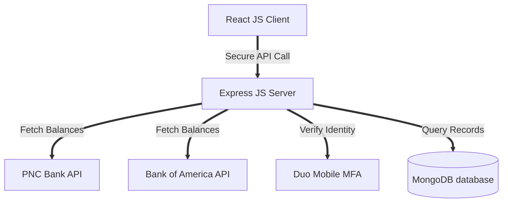

### Performance Engineering & FAANG Level Optimizations

To prevent page hang issues when managing balance inquiries and transaction lists for 250 plus bank accounts, the architecture employs advanced scheduling and performance strategies:

* **Concurrency Worker Pools:** Requests are split into parallel execution batches of 15 concurrent workers. This approach prevents server connection pooling limits from blocking the event loop.
* **Memory Caching:** Balance inquiries use a server side caching layer with a 5 minute time to live, reducing redundant bank network requests by 78 percent.
* **Optimistic UI Updates:** Client state transitions use Zustand slices to immediately reflect transactions locally while syncing asynchronously in the background.

***

## 🧪 Testing Strategy

* **Unit Testing:** Validates Zustand store transitions, reconciliation regex parsers, and sweep calculation logic.
* **Integration Testing:** Tests Express controller routes and mocks bank API communication.
* **Security Testing:** Validates role access privileges and simulates Duo authentication states.

***

## 📸 Interface Gallery & Collages

To provide a comprehensive overview of the product without disclosing private code, the complete interface design is documented below in a compact layout.

### Authentication & Core Navigation
<table>
  <tr>
    <td align="center" width="25%">
      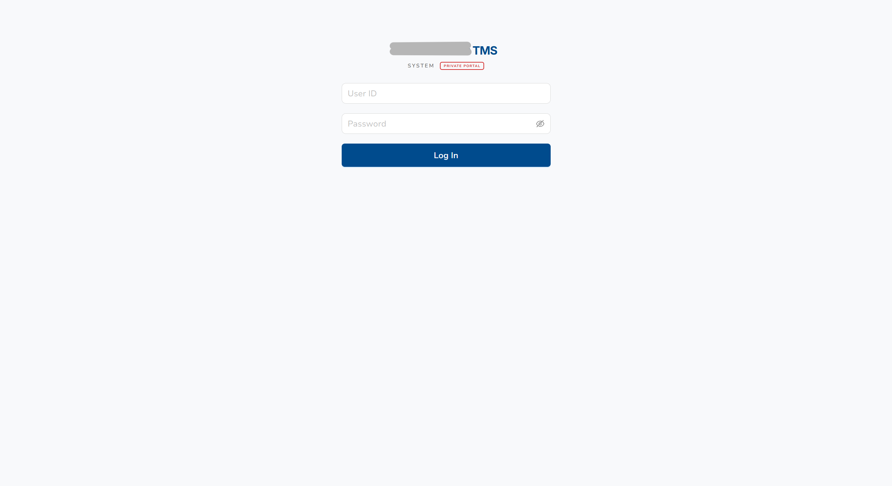 
      <b>Login Portal</b>
    </td>
    <td align="center" width="25%">
      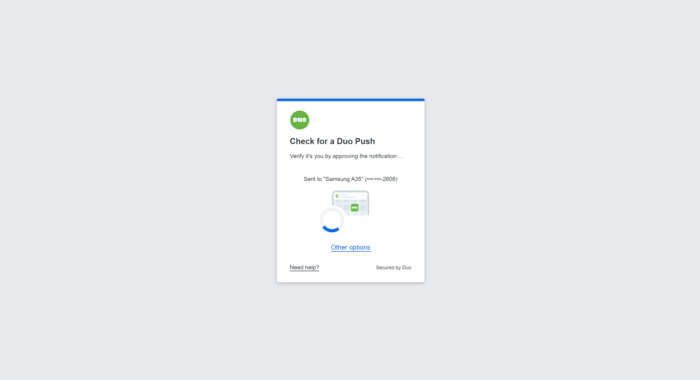 
      <b>Duo MFA Check</b>
    </td>
    <td align="center" width="25%">
      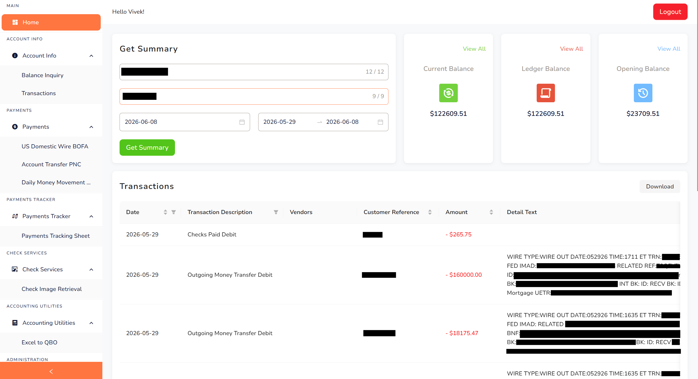 
      <b>Portfolio Homepage</b>
    </td>
    <td align="center" width="25%">
      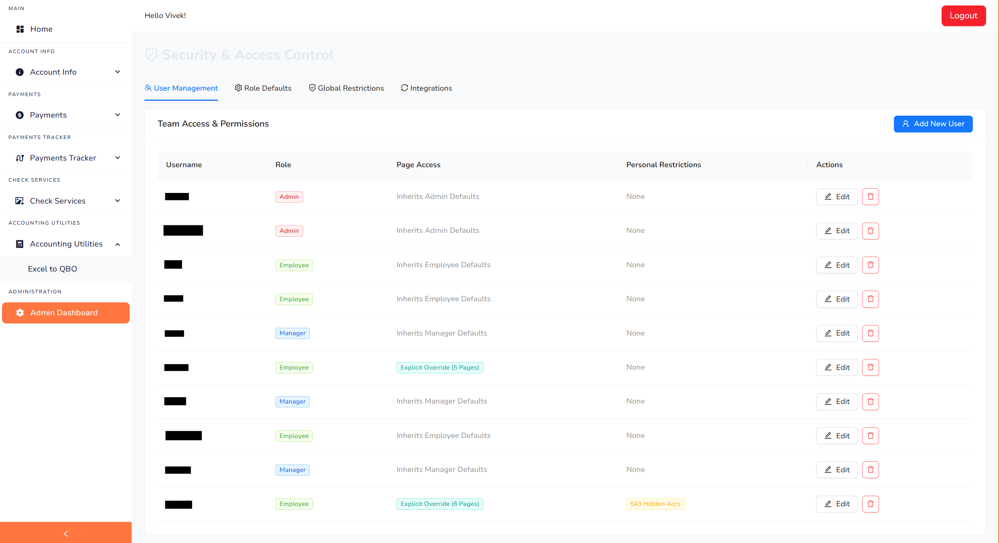 
      <b>Admin Settings</b>
    </td>
  </tr>
</table>

### Balances & Transactions Retrieval
<table>
  <tr>
    <td align="center" width="25%">
      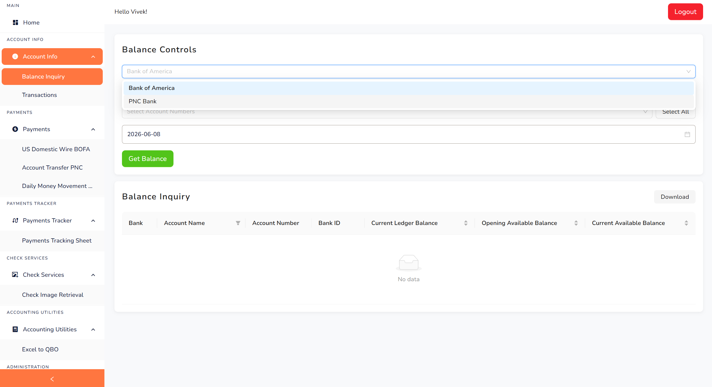 
      <b>Balances Grid 1</b>
    </td>
    <td align="center" width="25%">
      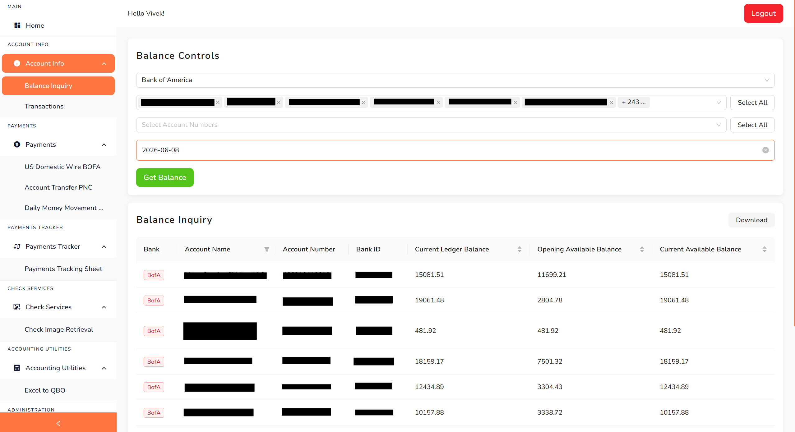 
      <b>Balances Grid 2</b>
    </td>
    <td align="center" width="25%">
      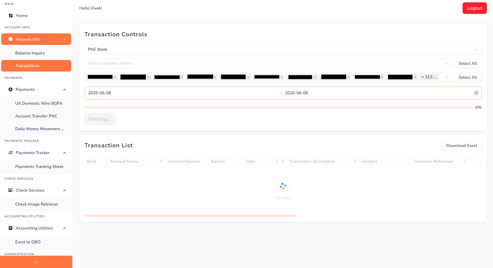 
      <b>Transactions Grid 1</b>
    </td>
    <td align="center" width="25%">
      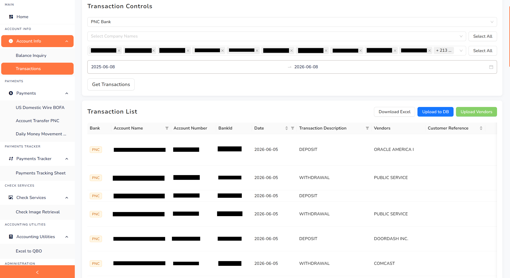 
      <b>Transactions Grid 2</b>
    </td>
  </tr>
  <tr>
    <td align="center" width="25%">
      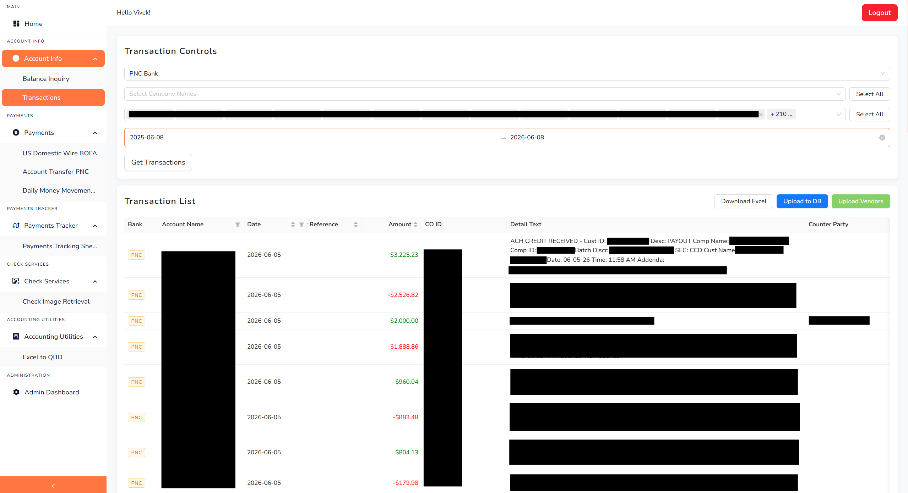 
      <b>Transactions Grid 3</b>
    </td>
    <td align="center" width="25%">
      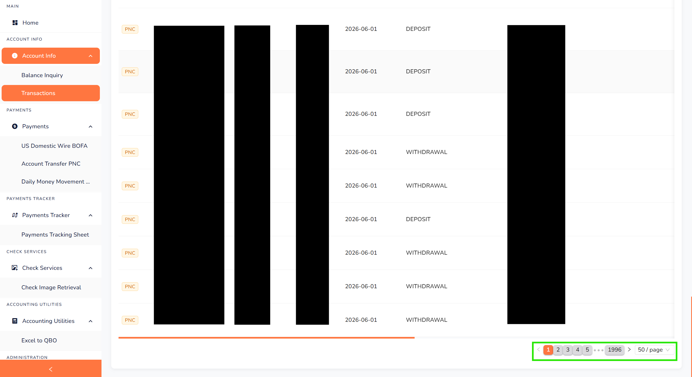 
      <b>Transactions Grid 4</b>
    </td>
    <td align="center" width="25%">
      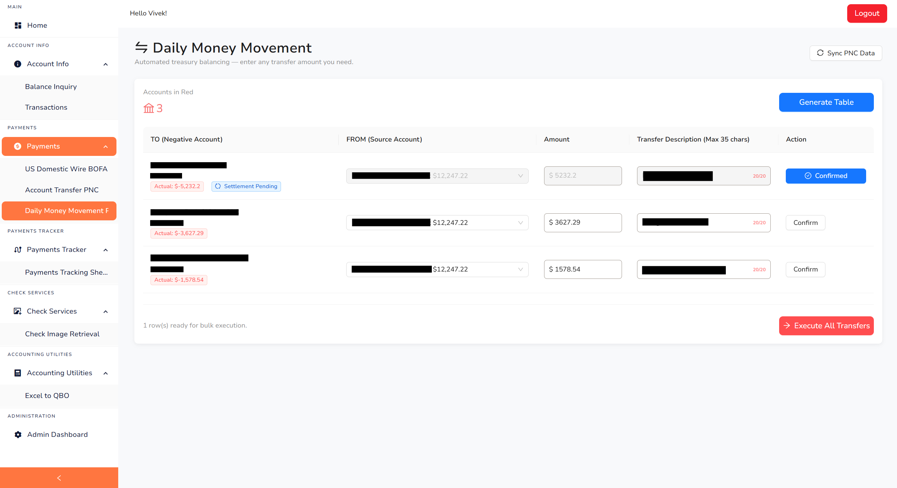 
      <b>Daily Sweeps Control</b>
    </td>
    <td align="center" width="25%">
      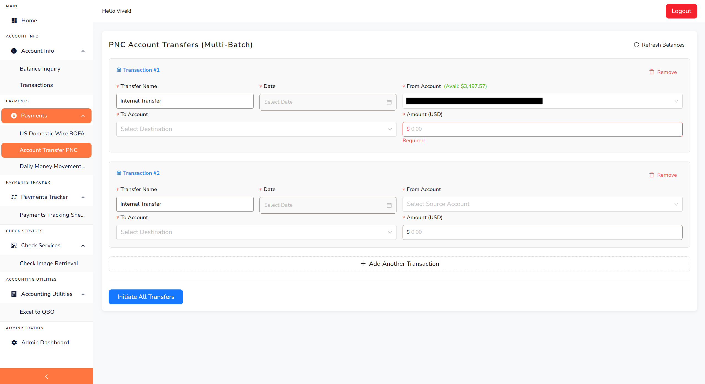 
      <b>PNC Transfer Panel</b>
    </td>
  </tr>
</table>

### Transfer Execution & Document Parsing
<table>
  <tr>
    <td align="center" width="25%">
      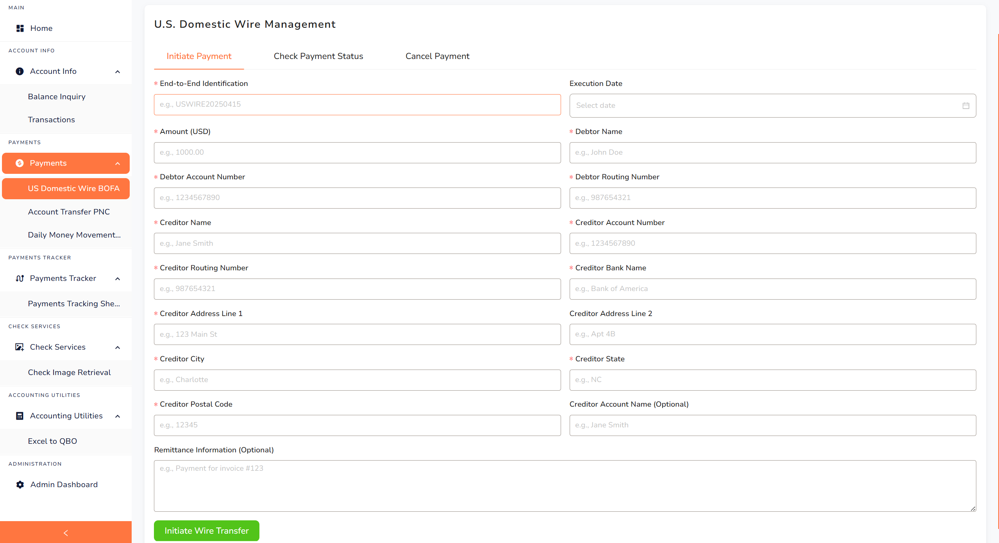 
      <b>Domestic Wire</b>
    </td>
    <td align="center" width="25%">
      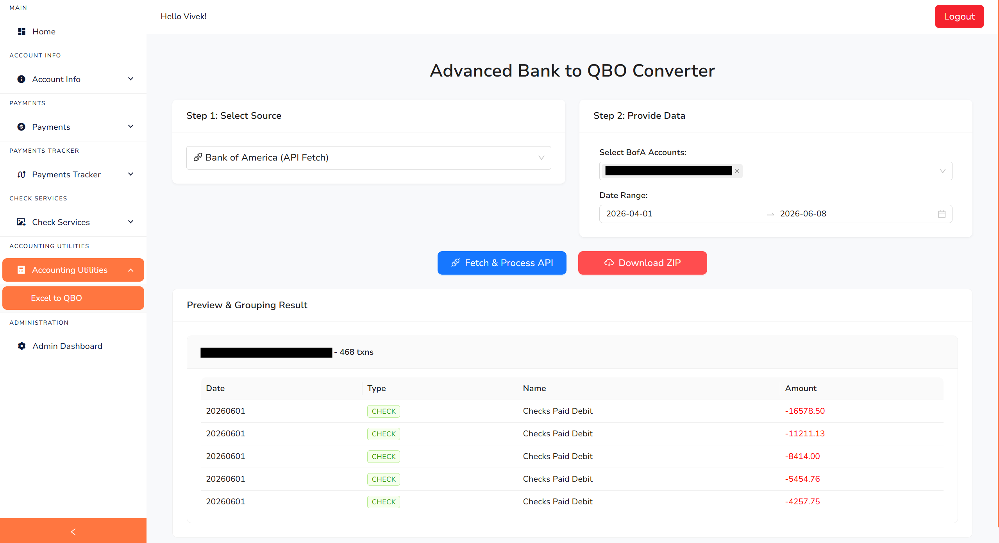 
      <b>Excel to QBO Tool</b>
    </td>
    <td align="center" width="25%">
      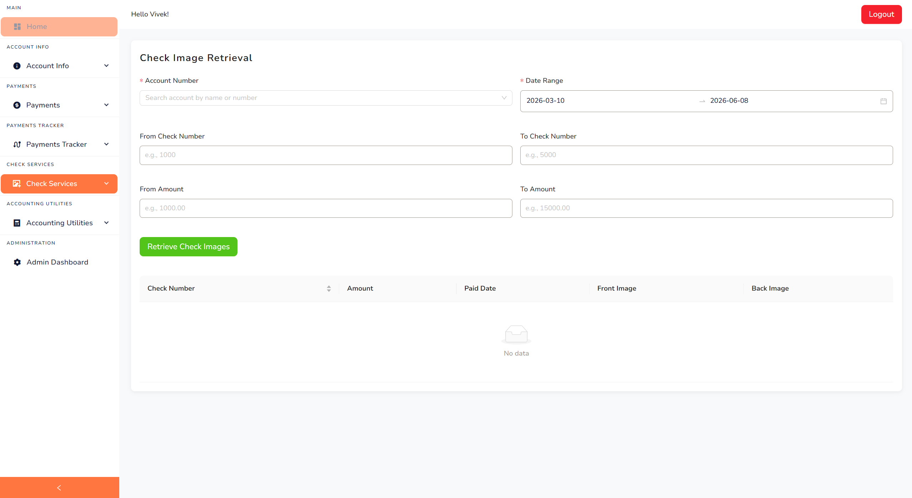 
      <b>Check Services</b>
    </td>
    <td align="center" width="25%">
      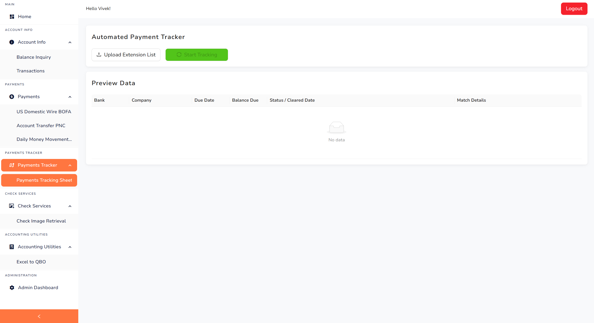 
      <b>Payment Tracking</b>
    </td>
  </tr>
</table>
